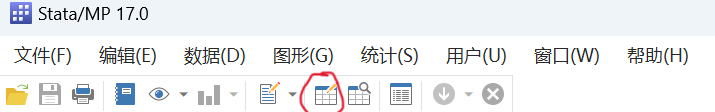
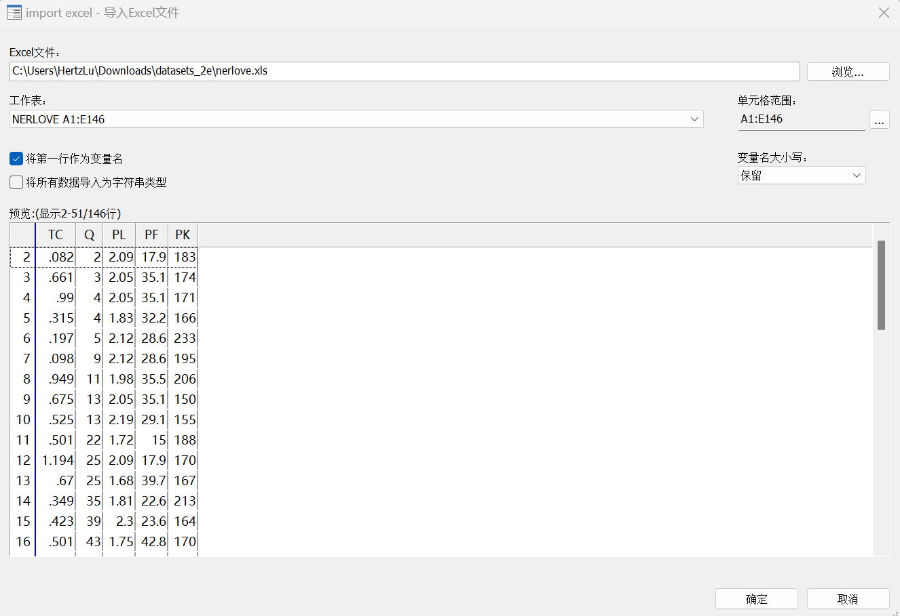
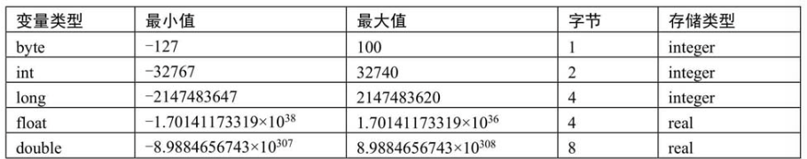
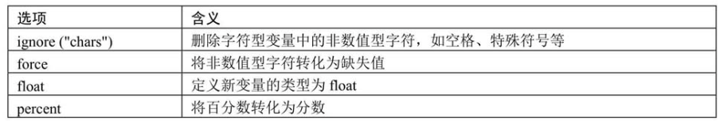
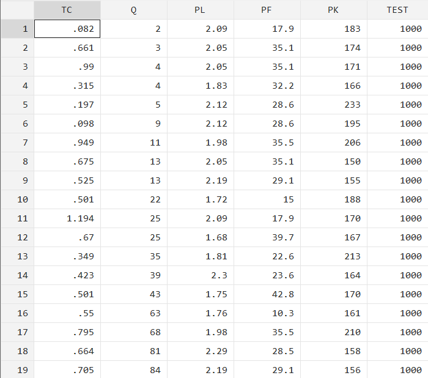

# STATA软件说明 & demo  

## 软件安装（中文版本）

**Windows版本**  
https://blog.csdn.net/Saki_Python/article/details/132314049  

## 课程数据集下载链接  

**我没有账号，这个可能是你们学校提供的链接**
https://llr.ntu.ac.uk/dbaz/dbDetail.php?dbID=93  
我这里使用的是数据集是陈强教授书籍里提供的，数据集在文件夹datasets_2e中  

## 导入数据到Stata  

### 方法一：通过打开数据编辑器将Excel的数据复制到Stata中  

**打开数据编辑器的方式：**  

- 通过Stata界面的快捷键

- 点击菜单中的窗口->数据编辑器打开  

### 方法二：导入文件，而不是复制，适用于数据量非常大的时候使用  

**使用菜单中的文件->导入即可，这里是导入窗口界面，可以做一些设置，包括变量以及选取范围**  
我这里的excel表比较简单，就5个变量的数据  
**这里关于变量名的命名规则，你们老师PPT里面有详细说明，应该是便于自动导入，所以需要去excel里面调整一下**

- TC:total cost 总成本
- Q:total output 总产量
- PL:price of labor 小时工资率
- PF:price of fuel 燃料价格
- PK:user cost of capital 资本的租赁价格  

## STADA中的数据类型  

**点击作用域的某个变量，下方属性窗口会说明变量数据类型，常用的数据类型有三种**  

### 数值型变量  

`一个字节 = 8位二进制数`  
`00000001 = 1` 最高位是0表示正数，是1表示负数，所以一个int型变量2个字节，正常可以表示的最大范围是`-2^15 ~ 2^15`，这里看起来似乎正数的后27位有别的用途(没去调研)，应该了解一下各个数值型变量代表的是整数还是小数，然后根据取值范围确定使用什么变量就行

  

### 字符型变量  

由字母、特殊符号和数字组成，这里的数字不等于上面说的数值型变量的，而是单个字符。字符型变量一般会被保存位`str#`格式，str后面的数字代表最大字符长度，比如`str6`表示可容纳最大长度为6个字符的字符型变量。字符型变量一般用英文状态下的引号`""`进行标注，且引号一般不被视为字符型变量的一部分

~~~C++
    //就像C++里面的字符串一样
    string str = "abc123";
    //每个元素都是字符型变量，也就是'a' 'b' '1' '2'这种
~~~

### 日期型变量

**Stata软件中用来表示时间的变量有多种表达方式，例如1987年8月15日可以写为19870815，也可以写为15081987。在Stata中将1960年1月1日看作分界线，为第0天**  

### 变量数据类型转化  

**自动导入数据可能会发现有些变量与预期的变量类型不符合，就需要修改变量数据类型**  

- 方法一：使用变量管理器，位置在数据编辑器右边，就可以打开变量属性编辑窗口  
- 方法二：使用命令代码  
  - 使用`destring`命令将字符型变量转换成数值型变量  
  `destring [varlist], [generate (newvarlist) | replace] [options]`  
  `destring [变量名字], [generate (生成新的变量名字) 或者 replace表示替换原来的变量]`  
  **还有一些可选设置在这个表里**
  
  - 使用`tostring`命令将数值型变量转化成字符型变量  
  `tostring [varlist], [generate (newvarlist) | replace] [options]`  

## 常用命令  

### 生成新变量  

- **gen**
    例如生成新变量TEST为1000 `gen TEST = 1000`  
      
- **egen**  
    比gen支持更多的函数，例如可以生成一个变量为每个栏目的和、中位数等等
    `egen wagesum = sum(wage)`  

## 懒得写了，感觉有些命令你自己看就ok了，都run一遍应该就能理解命令起什么作用了

## 一些问题DEBUG  

1. 你昨天发的winsor2命令，显然是没有安装额外的工具包，ssc应该是stata提供的 下载接口，所以少啥应该都可以用`ssc install packagename`  
    **解决办法：** 命令窗口输入 ssc install winsor2